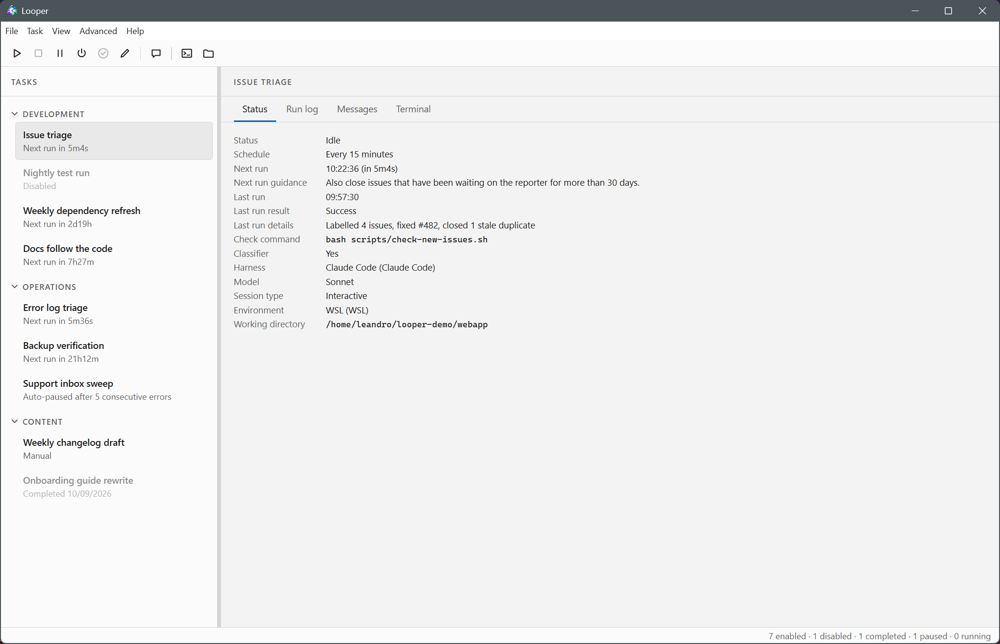

# Looper

**A manager for agentic loops.** Schedule AI agents like cron jobs, watch them
work in real terminals, and stop burning tokens on idle polling.



An agent that polls for its own work wastes tokens and context on every empty
check — and its conversation eventually fills up and gets compacted. Looper
inverts the loop: a cheap check script (and optionally a small classifier
model) decides whether there is work, and only then a fresh agent session is
started. No idle burn, no context rot, at most one agent per task, ever.

## Features

- **Cron-style scheduling** — wall-clock slots, timezones, schedule end dates;
  or manual tasks you fire on demand.
- **Token savings by design** — a shell check and an optional haiku-class
  classifier gate every run, so the expensive model only starts when there is
  real work to do.
- **Fresh session every run** — no context accumulation; the agent signals
  `looper-done`, files its report, and the loop resumes.
- **Monitoring built in** — per-task run log with results and reports, live
  status, and a real terminal tab you can watch *and type into* mid-run.
- **System notifications** — each task picks what it toasts, from errors-only
  to every run; clicking one lands on the live terminal or the run's log entry.
- **Any harness, any environment** — Claude Code, Codex, or a custom agent
  CLI; Looper on Windows driving agents inside WSL, or Linux/WSL directly.
- **Easy task setup** — an editor with Schedule / Check / Classifier / Agent
  tabs, templates, import/export; agents and scripts can register tasks by
  dropping a JSON file in the inbox.

## How a task runs

```
IDLE ──schedule──▶ CHECKING ──act:false──▶ IDLE
CHECKING ──act:true──▶ [CLASSIFYING ──no──▶ IDLE] ──yes──▶ RUNNING ──done──▶ IDLE
```

1. **Check** (optional) — your script runs in the task's directory and prints
   one JSON line: `{"act": true, "summary": "3 new issues", "context": {…}}`.
2. **Classify** (optional) — a cheap model gets the summary and answers
   `{act, reason}` under a strict schema; its cost is recorded in the run log.
3. **Agent** — a fresh session of the task's harness starts in the task's
   directory with your prompt (the check output templated in). It works in a
   real terminal inside Looper and ends the run with
   `looper-done <status> "<headline>"` plus a detailed report.

The check and the classifier are both optional — without them, every slot goes
straight to the agent. The full contract (prompt templates, every way a run can
end, held runs, idle detection) is in
[How a run works](docs/how-a-run-works.md).

## Quick start

No compiler toolchain needed — the terminal component ships prebuilt binaries
for Windows, Linux and macOS.

```bash
npm install
npm run dev            # run from source (Electron, hot reload)
npm run package        # or build the installer for your platform (release/)
```

On first launch Looper creates a Local Shell environment pointed at the
`claude` CLI (plus a WSL bridge on Windows). Then:

1. **File → New Task…** (Ctrl+N).
2. On the **General** tab, name the task and pick its working directory; on
   the **Agent** tab, write the prompt. Optionally add a check command on the
   **Check** tab. Save.
3. Select the task and press **F5** (Run Now). Watch the agent work in the
   **Terminal** tab.

The [Getting started guide](docs/getting-started.md) walks through this with
more detail, including the packaged Windows installer and notification setup.

## CLI & automation

The `looper` CLI and an inbox drop-folder let scripts — and other agents —
register and control tasks:

```bash
looper example > task.json      # template task definition
looper add task.json            # register it with the running app
looper run <taskId>
looper serve                    # run the engine headless, without the UI
```

See [CLI and automation](docs/cli-and-automation.md) for the full command set,
the inbox protocol, and a tour of the `~/looper` data directory.

## Documentation

The full user guide lives in [docs/](docs/README.md):

- [Getting started](docs/getting-started.md) — install, first launch, first task.
- [The task editor](docs/tasks.md) — every tab and field, templates,
  import/export, prompt template variables.
- [How a run works](docs/how-a-run-works.md) — the check → classify → agent
  cycle and every way a run ends.
- [Environments](docs/environments.md) — local shell, WSL and Windows bridges,
  harnesses and their models, concurrency caps.
- [Monitoring](docs/monitoring.md) — terminal tab, run log, notifications,
  Rest Mode, tray.
- [CLI and automation](docs/cli-and-automation.md) — the CLI, the inbox
  protocol, the data directory.
- [Troubleshooting](docs/troubleshooting.md) — common problems, current
  limitations.

## Development

```bash
npm run dev            # Electron app with hot reload
npm run build:all      # out/ (app) + out/cli/ (CLI + terminal worker)
npm test               # engine unit tests
npm run typecheck
```

The engine has no Electron imports, so it also runs standalone
(`looper serve`). Packaging targets: `npm run package:windows`,
`package:mac`, `package:linux`.

## License

MIT
