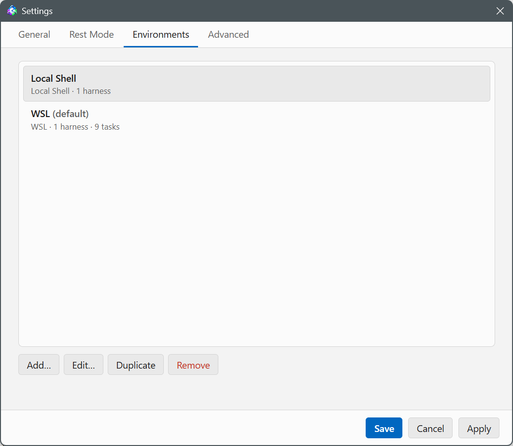
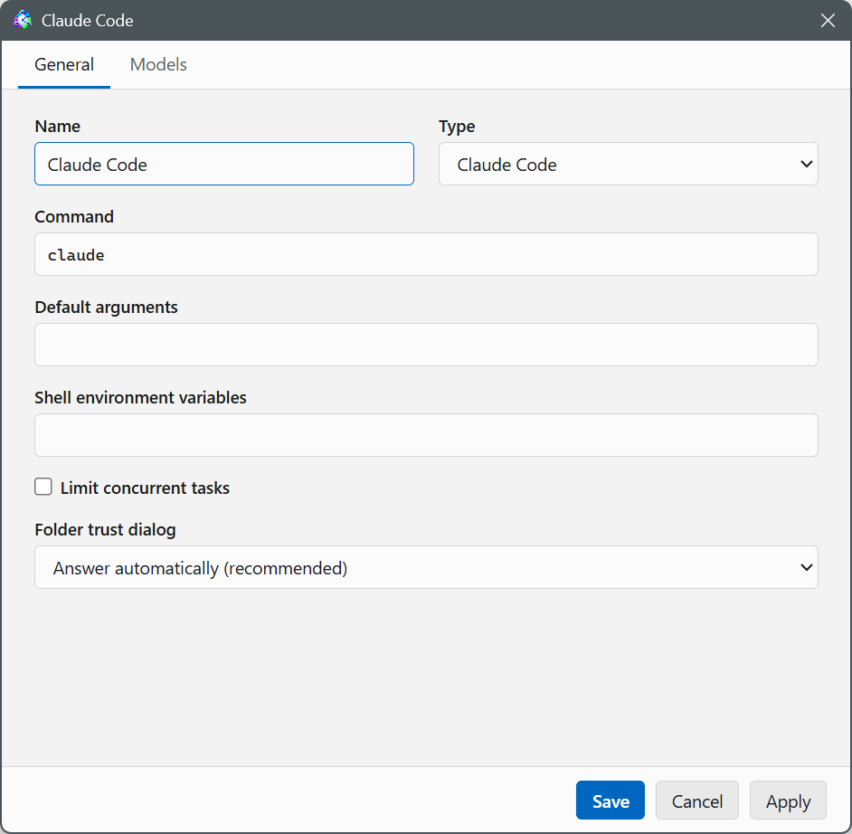

# Environments

**Settings → Environments** defines where Looper runs your checks and agents,
and which agent CLIs are available there.

## What an environment is



An environment is either the shell Looper itself runs in, or a bridge to
another one:

- **Local Shell** — the native shell of the machine Looper runs on: bash/zsh
  on Linux/macOS, PowerShell on Windows. Most users only need this one.
- **WSL distro** — a WSL distro, reached from a Windows host through
  `wsl.exe`.
- **Windows (PowerShell)** — native PowerShell, reached from inside WSL
  through Windows interop.

The environment editor's Type dropdown only lists the kinds your machine can
actually reach. On Windows that's Local Shell and WSL distro; inside WSL
it's Local Shell and Windows (PowerShell); everywhere else it's Local Shell
only. If you pick a WSL distro, a second dropdown lets you choose which one
(or leave it on "Default distro").

Environments live in a plain list: Add, Edit, Duplicate, Remove. Add creates
the environment immediately with a default Claude Code harness; closing the
editor without saving removes it again.

## Shell (WSL and non-Windows Local Shell)

Any environment that runs a POSIX shell — a WSL distro, or a Local Shell on a
non-Windows host — has a Shell setting on its Advanced tab:

| Option | Command | Effect |
|---|---|---|
| Same as your terminal (default) | `bash -lic` | Reads `~/.bashrc`, so tools whose installers only edit that file (nvm, bun) resolve without changes. Two harmless job-control warnings bash prints without a terminal are stripped from the captured output. |
| Basic shell, without your terminal setup | `bash -lc` | Reads only `~/.profile` and prints no warnings, but anything a check command or harness needs must be on the PATH that sets. |
| Custom | any shell and flags, e.g. `zsh -lc` | — |

This matters because the check script and the agent both run through this
shell: if a tool resolves in your interactive terminal but not in a task,
the Shell setting is usually why.

## Advanced: mount prefix

WSL and Windows (PowerShell) environments — the ones that bridge two
filesystems — have a "Windows drive mount prefix" field on their Advanced
tab, default `/mnt`. It's how the WSL side reaches the Windows drives (and
vice versa); change it only if your setup mounts them somewhere else. The
field's placeholder shows the prefix Looper actually detected for that
distro.

## Harnesses



Each environment holds one or more **harnesses** — agent CLIs installed
there. Manage them from the environment editor's Harnesses tab (Add, Edit,
Duplicate, Remove; at least one is required).

A harness has a Type:

- **Claude Code** gets full integration: `--model` and `--permission-mode`
  flags built from the task's Agent tab, an injected system prompt, idle
  detection (ends or holds a run that goes quiet after a turn), rolling
  conversations, and a per-harness "Folder trust dialog" setting — "Answer
  automatically (recommended)" or "Wait for user" — for the first-run trust
  prompt Claude Code shows for a new working directory.
- **Codex** gets the same level of integration through its own mechanisms:
  `--model` and sandbox/approval flags from the Agent tab, headless runs
  through `codex exec --json`, idle detection and the final report through
  codex's notify hook, rolling conversations through `codex … resume`, the
  classifier through `--output-schema`, the Messages view from its rollout
  transcripts, and the same "Folder trust dialog"
  auto-answer. Looper's instruction footer is prepended to the prompt (codex
  has no system-prompt flag), and interactive sessions run in codex's inline
  scrollback mode so the captured output stays readable.
- **Custom** is invoked as `command [args…] "<prompt>"`, with the footer
  prepended; a run ends via `looper-done`, process exit, or the max runtime.

`looper-done` is on PATH for all three kinds.

Each harness has its own Command, Default arguments, and Shell environment
variables — handy for two installs of the same tool under different
accounts or config directories. A harness can also cap "Limit concurrent
tasks" independently of its environment (see below).

Codex's models don't produce reasoning summaries by default, so a codex
run's Messages view shows no thinking rows. To get them, add these Default
arguments to the codex harness:

```
-c model_reasoning_summary=auto
```

Optionally add `-c model_reasoning_effort=medium` (or `high`) to raise the
reasoning depth at the same time.

## Models

A harness's Models tab holds the preset list that fills the Model dropdown
on a task's Agent tab. Add/Edit/Remove each entry. Left at its default, a
harness offers the CLI's main models by their unprefixed ids:

- Claude Code: Fable, Opus, Sonnet, Haiku
- Codex: GPT-6-Astra, GPT-5.6-Sol, GPT-5.6-Terra, GPT-5.6-Luna, GPT-5.5
- Custom: no presets

Each entry carries, besides its model id and optional display name:

- **Effort levels** — which of the harness kind's levels this model offers.
  A task on this model only sees these in its Effort dropdown. All levels by
  default.
- **Default effort** — the level a run emits when the task's Effort is
  Default. This keeps runs predictable: the effort comes from these
  settings, never from whatever the CLI on the machine was last set to. New
  entries — and every default-list entry — start at Medium; "CLI default"
  (omit the flag and let the CLI decide) is available as a deliberate
  choice.

A task can still type any other model id as "Custom…" in its Model dropdown.
Such an id has no entry here, so a Default effort can't be resolved for it:
the run omits the effort flag unless the task pins a level itself.

## Limiting concurrent tasks

Both an environment and a harness have a "Limit concurrent tasks" checkbox
(off by default) plus a "Maximum concurrent tasks" count when it's on. A
task counts against its environment's limit — and its chosen harness's — for
its whole cycle: checking, classifying, and running. A task whose
"Simultaneous runs" setting (see [the task editor](tasks.md)) lets it have
several runs in flight at once counts each of those runs separately, so such
a task can take up several slots of the cap by itself.

When a scheduled slot arrives and the environment or harness is already at
its cap, the task simply stays due and is retried on every following tick
until a slot frees up — it isn't skipped. A manual Run Now against a full
cap is rejected instead (logged as skipped) rather than queued.

## Which environment and harness a task uses

A task picks its environment on the editor's **General** tab, and one of
that environment's harnesses on the **Agent** tab (blank picks the
environment's first harness). The Agent tab is also where you set the
model, session type (interactive or headless), and — for Claude Code and
Codex — the permission mode; see [the task editor](tasks.md) for the full
field list.

The optional classifier step runs on a Claude Code or Codex harness (a
headless session by default, or an interactive one — its own Session type
field). Left blank, its Harness field on the Classifier tab resolves to the
task's own harness unless that's a Custom one, otherwise the environment's
first Claude Code or Codex harness; you can also pick a specific harness
(and model) there explicitly.

## Default environments

On first launch Looper creates a "Local Shell" environment (id `local`,
set as the default environment) plus the reachable bridge: a "WSL"
environment if the host is Windows, or a "Windows (PowerShell)" environment
if the host is WSL. Each starts with one harness, "Claude Code", running the
`claude` command with no extra arguments.

## Everything is a fresh session

No environment or harness setting changes this: every run starts a brand
new agent session, with no memory of previous runs. Put anything the agent
needs to remember between runs in the project's `CLAUDE.md`. See
[how a run works](how-a-run-works.md) for the full run lifecycle.
