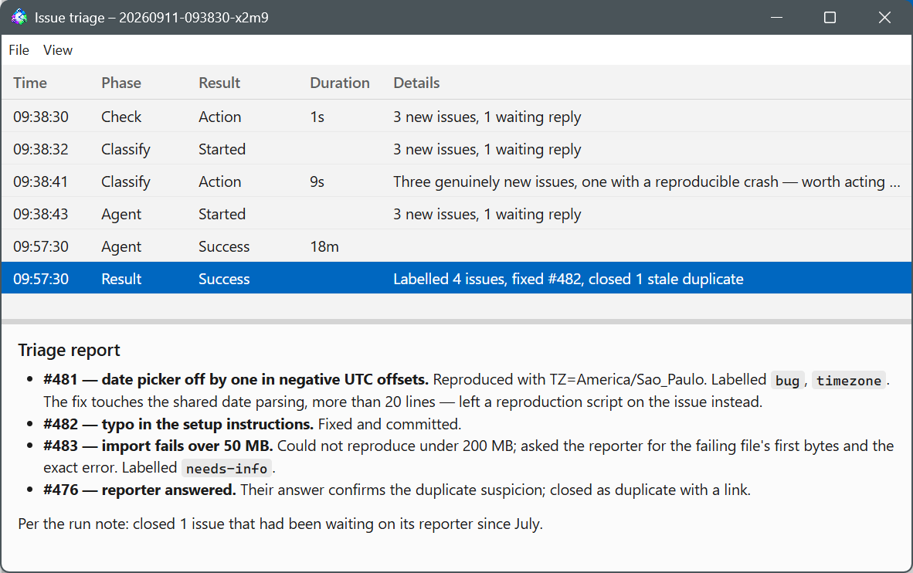

# How a run works

Every task cycles through the same states, whether it fires on a schedule or
you trigger it by hand:

```
IDLE ──schedule──▶ CHECKING ──act:false──▶ IDLE
CHECKING ──act:true──▶ [CLASSIFYING ──no──▶ IDLE] ──yes──▶ RUNNING ──done──▶ IDLE
```

The task list shows these as **Idle**, **Checking**, **Classifying**,
**Running**, **Paused**, **Disabled**, and **Completed** (finished for good;
see [the task editor](tasks.md#completion)). Check and classifier are both
optional (each has an enable switch in the [task editor](tasks.md)); without a
check, every due slot goes straight to the classifier or the agent.



## Checking

If the task has a check step, your script runs in the task's working
directory. The last non-empty line of its stdout must be a JSON object with a
boolean `act` field, e.g.:

```json
{"act": true, "summary": "3 new issues", "context": {"issues": [42, 57]}}
```

- `act: true` moves the cycle on (to the classifier, or straight to the
  agent). `summary` and `context` are optional and get passed along.
- `act: false` ends the cycle as **No action** — nothing else runs.
- A non-zero exit code, a timeout, or output whose last line isn't valid JSON
  with a boolean `act` is always an **error**, never a "nothing to do".
  Errors count toward auto-pause (see [troubleshooting](troubleshooting.md));
  a deliberate no-op never should be signaled as one.
- A failure caused by the computer being offline is recorded as a network
  error instead of an ordinary one — see
  [troubleshooting](troubleshooting.md#the-computer-was-offline-when-a-task-ran).

## Classifying

If a classifier is configured, it runs after a check that returned
`act: true` (or on every slot if there's no check). It's a Claude Code
session at the configured model (`haiku` by default) with the check's
`summary`/`context` folded into your prompt, under its own timeout — run the
same two ways as the agent. Headless (the default) is a `claude -p` call
that must answer `{"act": boolean, "reason": string}` under a strict schema.
Interactive runs in a real pty shown in the task's terminal tab — you can
watch it and type into it — and gives its verdict by running
`looper-classify act "<reason>"` or `looper-classify noop "<reason>"`,
followed by a short closing message. In both modes the classifier's output
streams to the terminal tab, its conversation shows in the run's Messages
window (replies typed as **Classifier**), and its files live under
`classify-*` in the run folder, fully separate from the agent's.

`act: false` ends the cycle as **No action** with the classifier's `reason`
as the detail; a malformed or failed response is an **error**, same as the
check. A failure caused by the computer being offline is recorded as a
network error instead — see
[troubleshooting](troubleshooting.md#the-computer-was-offline-when-a-task-ran).

Skipping the classifier's fee on obvious no-ops is its whole purpose: it's a
cheap model call standing between a noisy check and an expensive agent
session.

## Starting the agent

Once check and classifier both said go, the task's harness (Claude Code,
Codex, or a custom CLI) starts a **fresh session** — no memory of earlier
runs — in the task's working directory, interactive by default in a real pty
shown in the task's terminal tab (`mode: "headless"` runs without one, driven
by plain pipes).

The prompt is your template with `{{summary}}` / `{{context}}` (plus
`{{task}}`, `{{taskId}}`, `{{runId}}`, `{{trigger}}`) filled in. If your
prompt doesn't reference `{{summary}}`/`{{context}}`, Looper appends the check
output under a `## Check output` heading so the agent still sees it. If the
task has a one-off guidance note (see below), it's appended
last, under a `## One-off guidance for this run` heading, so it overrides
anything conflicting earlier in the prompt.

Looper also tells the agent, via a system-prompt footer (Claude Code) or a
prepended block (Codex/custom), that this is a one-shot unattended session
and that it should act without asking for confirmation.

## Ending a run

A run ends on the first of these:

- **The agent signals it's done.** It runs the shell command
  `looper-done <status> "<headline>"` — `status` is `success` (everything
  fully done), `warning` (fully done, but read the report), or `error`
  (couldn't complete; say why); omitted means success. It then writes its
  final message: a detailed Markdown report of what it did. For Claude Code
  in interactive mode, a `Stop` hook Looper injects captures that message the
  moment the turn ends, and the session is closed. The run's result in the
  log is whatever status you gave `looper-done`.
- **Idle timeout (Claude Code, interactive only).** If a turn finishes and
  the agent sits longer than `idleGraceMin` minutes without calling
  `looper-done`, the run ends as **Idle timeout** — or, if the task's
  `onIdleTimeout` is set to `hold`, it's held for a human instead (see
  below). The same clock also starts the moment any interactive prompt (a
  permission request, a question) is on screen, since the agent is then
  waiting on a human either way.
- **The agent process exits** on its own, with or without calling
  `looper-done` first. If it exits after signaling done but before its final
  message arrived, the run still ends as done, with the headline only (no
  report body).
- **`maxRuntimeMin` is exceeded**, regardless of what the agent is doing.

For Claude Code, the injected `Stop` hook also gates the end of a turn.
A turn ending with background tasks still running is blocked — the session
would close and kill them with no notification able to wake the agent — and
the agent is told to wait for their results or stop them first. A turn ending
without `looper-done` having been called gets one reminder to run it; if the
agent ends its turn again without it, the stop goes through (in interactive
mode, that's when the idle clock starts). Once `looper-done` has run, every
stop is allowed.

In `headless` mode there's no terminal to watch: process exit is the only
signal. The agent's final response becomes the report; `looper-done` still
names the headline if the agent ran it, otherwise the response's first line
does.

You can also end a run yourself with **Stop Task** (toolbar, Shift+F5, or
context menu) at any point in the cycle — checking, classifying, or running.
It kills whatever step is in flight and records the run as **Stopped**.

## Finishing the task for good

A task whose **Allow this task to be marked completed** option is on also gets
a `looper-complete "<why>"` command on the agent's PATH, and a line in the
system footer telling it when to use it: the task is finished for good, not
merely done for now. The agent runs it before `looper-done`; the run itself
ends exactly as it otherwise would, and Looper completes the task once the
cycle is over — the task stops being scheduled, moves to the completed-tasks
folder if one is set (Settings → General), and is deleted when the
completed-task retention runs out. A run you stopped never completes the
task, and a task without the option never gets the command: a completion
signal from one is recorded in the run log and ignored.

The same option gates the manual action: Task → Complete is greyed out
without it. A scheduled task with a **Stop running on** date completes itself
once that date passes, option or not — the date is the instruction to stop.

## Held for a human

When a Claude Code interactive run times out idle with `onIdleTimeout: hold`,
the run isn't ended — it's held. The task list shows **Needs attention** and
the status pane reads "The agent is waiting for you in the Terminal tab".
Nothing about the run is lost; it's still the same session, just paused for
input.

To resume it, open the task's **Terminal** tab and type your answer directly
into the running session — the moment you send input, the hold clears and the
idle clock resets. There's no separate "resume" button for this; it's driven
by the same terminal you'd use to watch the run. You can still **Stop Task**
a held run if you'd rather abandon it.

## Skipped, deferred, and manual runs

- **A task allows as many runs in flight at once as its "Simultaneous runs"
  setting** (task editor, Settings tab; default 1). Below that cap, a
  scheduled slot coming due while the task is already checking, classifying,
  or running starts another cycle alongside the ones in progress. At the cap,
  the due slot is recorded as skipped ("scheduled run skipped: N runs already
  active") and the next one is computed normally. **Run Now** (F5, toolbar,
  or context menu) follows the same cap: below it, Run Now starts another
  run even while one is active; at the cap it's refused outright and recorded
  as skipped, the same as a scheduled slot — it isn't retried automatically.
  The CLI/inbox `run` command behaves the same way. When more than one run of
  a task is in flight, the **Terminal** tab shows a run selector above the
  console so you can pick which one to watch and type into; the task's status
  and last-result always reflect whichever run finished most recently.
- **Concurrency limits defer, they don't skip.** An [environment or
  harness](environments.md) can cap how many tasks (counting each run of a
  task separately) run in it at once. A task that's due but over that cap
  simply stays due and is retried every tick until a slot frees up; nothing is
  logged as skipped for this.
- A **manual task** (schedule turned off in the task editor) never fires on
  its own; it only runs via Run Now, the toolbar, the context menu, or the
  CLI/inbox `run` command. `{{trigger}}` in your prompt is `"manual"` for
  these runs and `"timer"` for scheduled ones.

## One-off guidance notes

You can attach one-off guidance to a task's next run(s) — via the toolbar
("Add/Edit Guidance for Next Run"), the Task menu, or the context menu. It's
free text plus how many upcoming runs it applies to, and it's appended to the
agent's prompt as described above.

Each run whose agent actually received the note uses up one of those charges;
once it reaches zero the note is cleared. A run does **not** spend a charge
if it never got the note to a running agent in the first place — an
engine-level error before or instead of the agent doing any work (a spawn
failure, a Claude Code usage-limit rejection) or a run you stopped yourself.
Any other ending — including the agent finishing and reporting
`looper-done error` — does consume the charge, since the agent did receive
and act on the guidance even if it didn't succeed.
