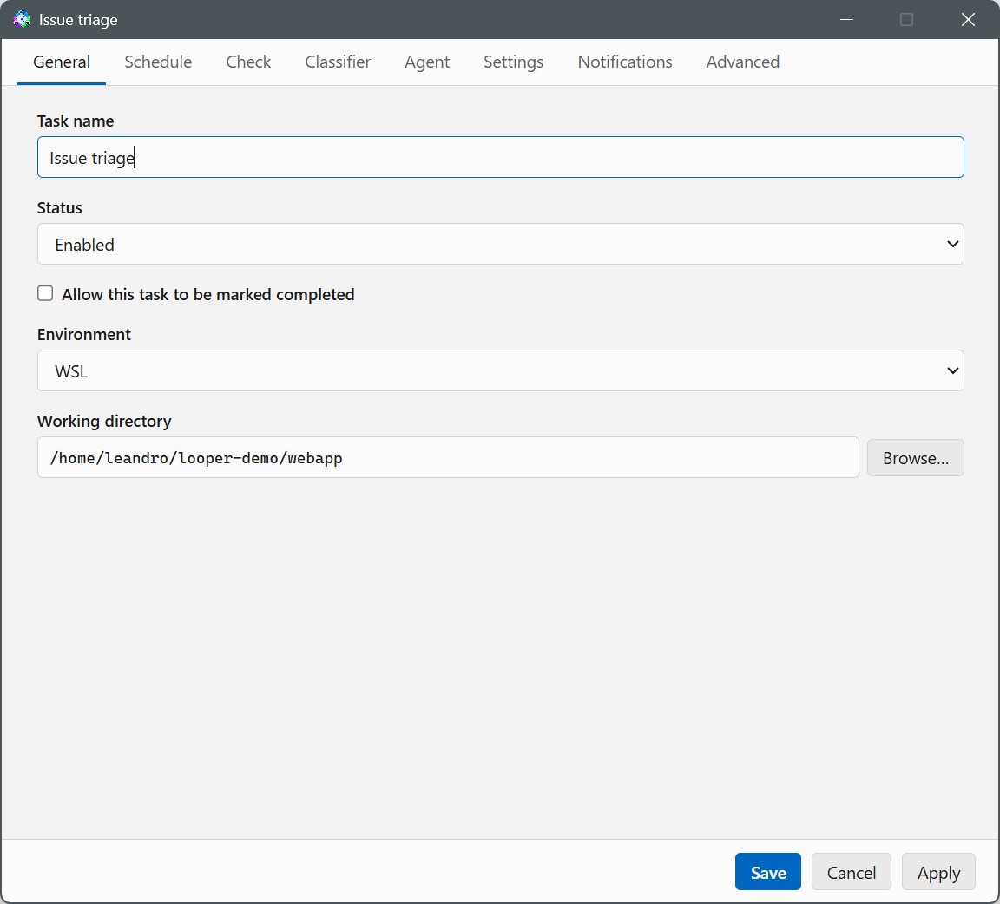
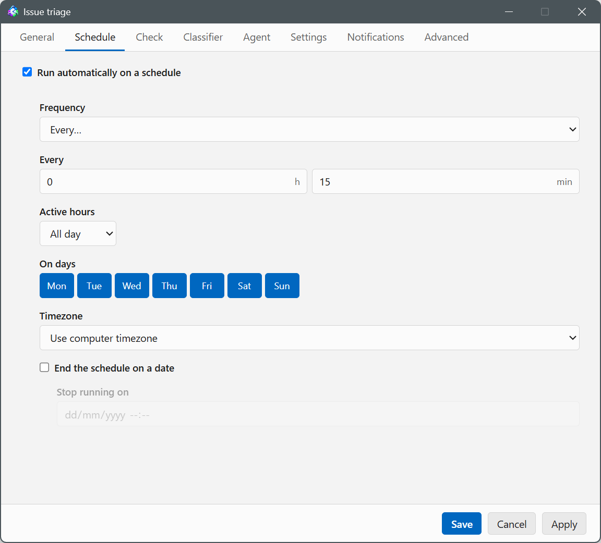
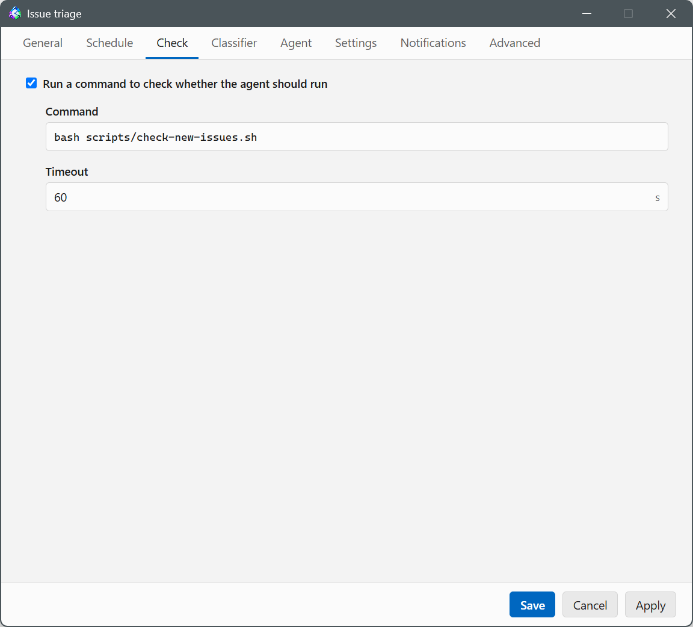
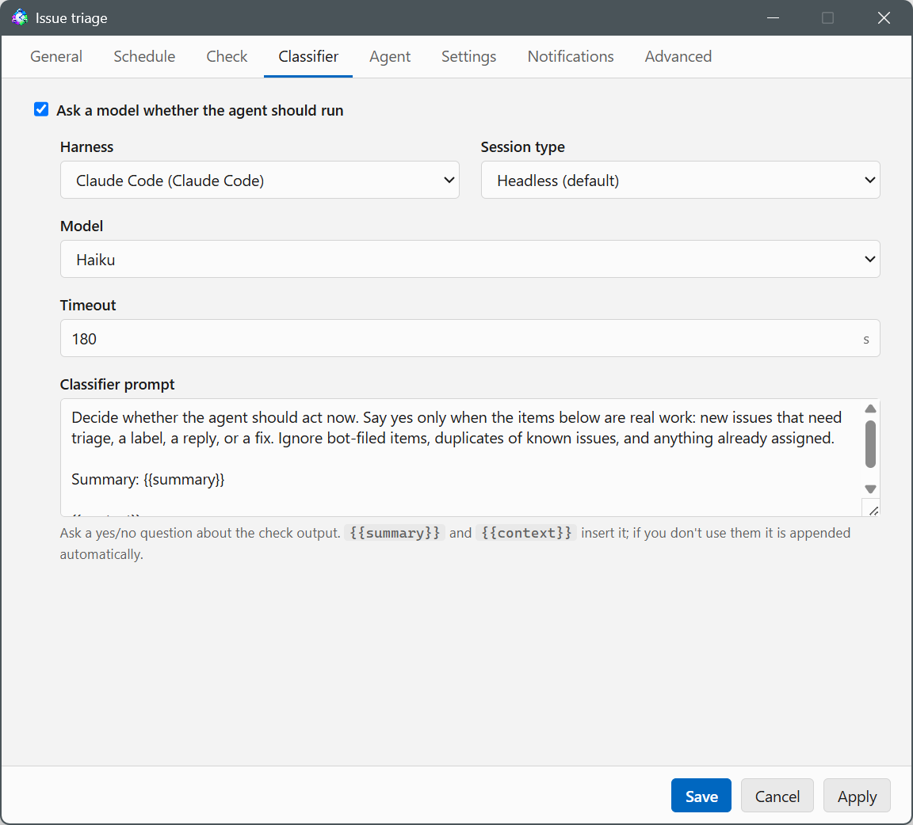
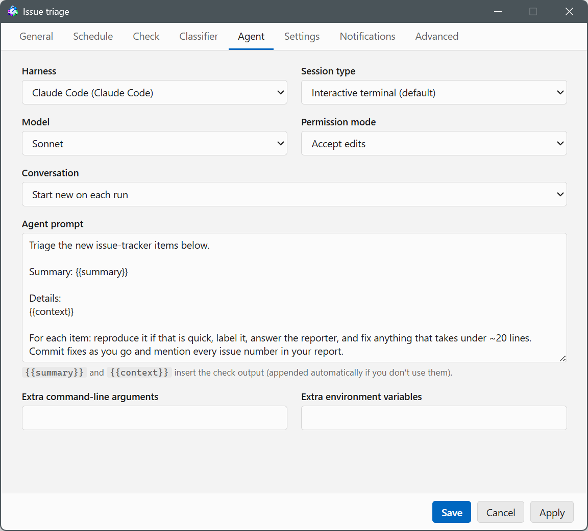
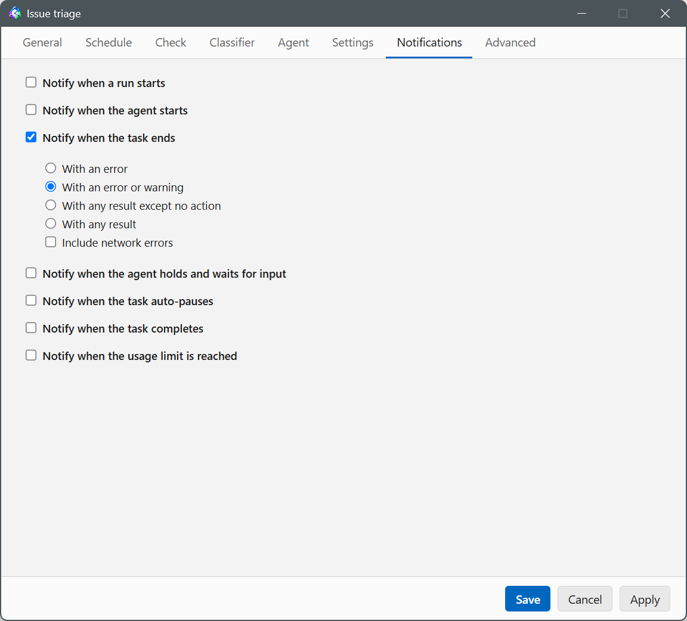

# The Task Editor

Every task — new, from a template, or an existing one you're editing — opens
in the same editor window, organized into tabs. Save writes the task and
closes the window; Apply saves without closing; Cancel discards unsaved
changes.

## General

- **Task name**
- **Status** — Enabled, Disabled or Completed. A disabled task never runs on
  its own; Run Now still asks for confirmation before running it anyway. A
  **completed** task is finished for good: it behaves like a disabled one, but
  it also moves to the completed-tasks folder (Settings → General), shows as
  completed in the task list, and is deleted once the completed-task retention
  (Settings → Advanced) runs out. Task → Reopen brings it back.
- **Allow this task to be marked completed** — off by default, and required
  before anything can complete the task. With it on, Task → Complete is
  available, and the agent's session gets a `looper-complete "<why>"` command
  plus a line in its system prompt explaining when to use it: the task is
  finished for good, not merely done for now. Looper applies the agent's
  signal when the cycle ends, unless you stopped the run. With the option off
  the Complete action is greyed out, the agent's command is never created, and
  a completion signal from such a task is recorded in the run log and ignored.
  A schedule or watcher trigger that reaches its **Stop running on** date
  completes the task either way — that date is itself the instruction to
  stop.
- **Environment** — which configured environment (Settings → Environments)
  the task's check, classifier, and agent run in.
- **Working directory** — the folder the check command and the agent both
  run in, in the path style the environment expects. Browse… opens a picker
  scoped to that environment.

A completed task keeps its whole definition and its run history until it is
deleted, so the final report stays readable in the Run log and Messages tabs.
Where completed tasks are filed is a global choice — Settings → General →
**Move completed tasks to folder**.

## Trigger

What starts the task's runs — `trigger.mode` in the JSON: **Manual**,
**Schedule**, or **Watcher**. Only one mode is selected at a time; switching
modes keeps the other modes' configuration, like a disabled step keeps its
fields.

- **Manual** — the task never fires by itself. Run Now, the toolbar, the
  context menu, or the CLI/inbox `run` command are the only ways to start it.
- **Schedule** (`trigger.schedule`) — a cron expression (`cron`) and an
  optional IANA `timezone`. **Frequency** selects how the cron expression is
  built:

  | Frequency | Fields |
  |---|---|
  | Every… | An hour/minute step, an optional "Active hours" window (all day, or between two hours), and which days of the week it applies on |
  | Daily | One or more times of day (Add time); each must share either the hour or the minute with the others |
  | Weekly | A time of day and which days of the week |
  | Monthly | A time of day and which days of the month |
  | Custom | A raw cron expression |

  A live preview shows the next run time, or a warning if the expression is
  invalid. **Timezone** picks the IANA zone the schedule's slots are
  evaluated in; "Use computer timezone" (the default) follows the machine's
  own timezone.
- **Watcher** (`trigger.watcher`) — a long-running **Command** and a
  **Batch events for** (`debounceSec`, default 5s) window. See "Watcher
  contract" below for what the command must do. Three more options shape
  when runs may start:
  - **Run once when watching starts** (`runOnStart`) — one catch-up run
    whenever watching starts cold: app launch, the task being enabled, a
    pause lifted, or the system waking. The run carries no events; a check
    step with its own cursor re-derives whatever happened while nothing was
    watching. It never fires on crash restarts, and any event run that
    starts first settles it.
  - **Active hours** (`activeHours.from`/`.to`) and **On days** (`days`,
    0 = Sunday) — runs only start inside the window; events arriving outside
    are held and coalesce into one run when it opens. The watcher process
    itself keeps running around the clock, so nothing is missed. A manual
    Run Now ignores the window.
  - **Timezone** (`timezone`) — the zone the hours/days are evaluated in;
    unset = the computer's.

A checkbox, "Stop on a date", turns on **Stop running on**
(`trigger.stopOn.enabled` / `.at`) — the date and time the trigger ends. Once
it passes, Looper completes the task instead of running it again: it stops
being scheduled or watched, moves to the completed-tasks folder if one is
set, and is deleted when the completed-task retention runs out. It applies to
the schedule and watcher modes, including a paused or disabled task; a manual
task ignores it. Unchecking the box keeps the date on the task and simply
stops it from applying, and reopening a task whose end date has passed
switches that date off rather than erasing it.

### Watcher contract

The watcher command is a **long-running process**, spawned once in the
task's environment and working directory whenever the task is enabled and
the watcher mode is selected — it is not re-run per event.

- Each **non-empty line on stdout is one trigger event**. JSON is
  recommended, one object per line, but any non-empty line counts.
- **stderr is diagnostics** — kept for the exit message, never treated as
  events.
- **Exiting means "restart me"**: Looper restarts the command with
  exponential backoff, 5s doubling up to 5min. Repeated fast crashes — the
  same **Auto-pause after** count (Settings tab) used for run errors —
  auto-pause the task, which also stops the watcher.
- **Start quiet**: emit only events that happen after launch. Looper does
  not replay history on startup, so a script that dumps its backlog on start
  would trigger a run for everything that already happened.
- Events are collected for **Batch events for** (`debounceSec`) and delivered
  as a single batch: a burst within that window becomes one run, not one per
  line. A batch that arrives while the task is already at its concurrency cap
  (Settings tab, **Simultaneous runs**) waits and keeps growing until a slot
  frees up, still landing in a single follow-up run.
- The batch reaches the run as `<runDir>/events.jsonl` (env var
  `LOOPER_EVENTS_FILE`), the `{{events}}` prompt placeholder, and — when a
  prompt uses neither — an automatically appended "## Trigger events"
  section, the same way check output is appended when the prompt doesn't
  reference it.
- Pausing, disabling, or completing the task stops the watcher; resuming or
  re-enabling it starts a fresh one, with a clean crash streak.
- The check, classifier, and agent steps all see `LOOPER_TRIGGER` (env var,
  also `{{trigger}}` in prompts) set to `timer`, `manual`, or `watcher`,
  depending on how the cycle started.

## Check

The checkbox "Run a command to check whether the agent should run" turns the
check step on or off. Off means every scheduled slot goes straight to the
classifier/agent.

- **Command** — a shell command, run in the task's working directory. The
  **last non-empty line of its stdout must be JSON**, e.g.
  `{"act": true, "summary": "3 new issues", "context": {"...": "..."}}`.
  `act` is required and boolean; `summary` and `context` are optional and
  are what the classifier and agent prompts see. If `act` is `false`, the
  cycle ends there — no classifier, no agent. A non-zero exit code, a
  timeout, or a last line that isn't valid JSON with a boolean `act` is
  always an **error** — never a trigger, and never "nothing to do".
- **Timeout** — seconds before the command is killed and the cycle recorded
  as an error. Default 60s.

## Classifier

The checkbox "Ask a model whether the agent should run" turns the
classifier step on or off. When on, it runs after a check that returned
`act: true` (or on every slot if there's no check).

- **Harness** — which Claude Code harness in the task's environment runs the
  classifier: the task's own harness if it's Claude Code, otherwise the
  environment's first Claude Code harness.
- **Session type** — Headless (default): `claude -p` / `codex exec` over
  pipes, answering under a strict `{act, reason}` schema (claude
  `--json-schema` / codex `--output-schema`). Interactive terminal: a real pty
  shown in the task's Terminal tab (you can watch it and type into it); the
  session gives its verdict by running `looper-classify act "<reason>"` or
  `looper-classify noop "<reason>"`, then writes a short closing message.
- **Model** — a preset from the harness's model list, or Custom… to type a
  model id. Defaults to `haiku`.
- **Timeout** — seconds before the classifier session is killed and treated
  as an error. Default 180s.
- **Classifier prompt** — your yes/no question about the check output.
  `{{summary}}` and `{{context}}` insert the check's output where you place
  them; if the prompt doesn't reference either, they're appended
  automatically. The `reason` (one sentence) is shown in the run log; the
  classifier's full conversation appears in the run's Messages window with
  its replies typed as **Classifier**.

## Agent

- **Harness** — which harness in the task's environment runs the agent.
- **Session type** — Interactive terminal (default): a real pty shown in the
  task's Terminal tab, which you can type into. Headless: no terminal; the
  harness runs non-interactively (`claude -p` / `codex exec`) and its exit
  is the only signal.
- **Model** — shown for Claude Code and Codex harnesses: a preset from the
  harness's model list, Default (the CLI's own default), or Custom… to type
  a model id.
- **Permission mode** — Claude Code and Codex. For Claude Code it's passed
  as `--permission-mode`: Auto, Accept edits, Manual, Don't ask, Plan mode,
  Bypass, or None (omits the flag entirely). For Codex it maps to its
  sandbox/approval flags: Auto (`--approve-for-me` — workspace-write sandbox
  with automatic approval review), Read-only sandbox, Workspace-write
  sandbox, Full access (each pinning `--sandbox`, never asking), Bypass
  (`--dangerously-bypass-approvals-and-sandbox`), or None. Sandboxed codex
  runs also get `--add-dir` for the run directory, so `looper-done` can
  write its signal files there.
- **Conversation** — Claude Code and Codex. New each run (the default) starts
  every run as a fresh session. Continue across runs keeps one rolling
  conversation: with Claude Code the first run starts it (`--session-id`) and
  later runs resume it (`--resume`); with Codex the first run's thread id is
  captured and later runs `codex … resume` it. Either way the agent remembers
  what it already saw and reported.
  It requires Settings → Simultaneous runs to be 1, since a rolling
  conversation can't be shared by overlapping runs.
  **New conversation after** caps the roll — after that many runs the next
  run starts a new conversation (a cap of 1 behaves like New each run).
  If the conversation to resume no longer exists (e.g. its transcript was
  cleaned up), that run ends as an error saying so and the next run starts a
  new one. Editing the task's working directory, environment, or harness
  also starts a new one, since a conversation can't move.
- **Agent prompt** — the instructions the agent starts with. `{{summary}}`
  and `{{context}}` insert the check's output where you place them; if the
  prompt doesn't reference either, they're appended under a "## Check
  output" heading automatically. See [prompt template
  variables](#prompt-template-variables) below for the full set.
- **Extra command-line arguments** — appended verbatim to the harness
  command line.
- **Extra environment variables** — set for every step of this task (check,
  classifier, agent); these override the same variable on the harness.

## Settings

- **Max runtime** — minutes before a run is force-ended regardless of
  activity. Default 120.
- **Auto-pause after** — consecutive failed cycles before the task pauses
  itself with a visible reason. Default 5.
- **Idle grace** — minutes the agent may sit idle (a turn finished, no
  `looper-done` signal) before the run ends or is held. Default 3. Idle
  detection is Claude Code only; other harnesses end a run only via
  `looper-done`, process exit, or Max runtime.
- **When idle too long** — End the run, or Hold and wait for me (the run
  pauses for you to continue it by hand in the terminal).
- **Simultaneous runs** — cycles of this task that may be in flight at once.
  Default 1, which is today's behavior: a slot due while a run is active is
  skipped. Above 1, a due slot starts another run alongside the ones already
  going instead of being skipped, up to the cap. Incompatible with the
  agent's "Continue across runs" — the editor refuses to save that
  combination.

## Notifications

Each toggle sends a separate system notification (subject to the master
switch in Settings → General and the tray menu, and to nothing firing while
a Looper window is focused):

| Toggle | Fires when |
|---|---|
| Notify when a run starts | A cycle starts (the check step included) |
| Notify when the agent starts | The agent step starts |
| Notify when the task ends | The cycle ends — see levels below |
| Notify when the agent holds and waits for input | The agent went idle and is holding for you |
| Notify when the task auto-pauses | The task auto-pauses after consecutive errors |
| Notify when the usage limit is reached | A run hits a Claude Code usage limit and waits for the reset |
| Notify when the task completes | The task is finished for good — the agent completed it, its deadline passed, or you completed it yourself |

"Notify when the task ends" has four levels, from narrowest to broadest:

- **With an error** — only cycles that ended in an error.
- **With an error or warning** — errors and warnings (the default).
- **With any result except no action** — everything except a cycle that
  found nothing to do.
- **With any result** — every ending, including no-action.

**Include network errors** — off by default. When a run fails only because
the computer was offline (a check that couldn't reach the network, or Claude
Code unable to reach its API), no end notification fires unless this is on.
These runs also never count toward auto-pause.

A cycle sends at most one end notification: if usage-limit, auto-paused or
completed fires, it replaces the plain end notification.

## Advanced

A raw JSON view of the whole task definition — the same shape as
[`examples/task.example.json`](examples/task.example.json) and what the
CLI's `looper add` accepts.
Switching to this tab serializes your current edits; switching away parses
your JSON back into the other tabs. Useful for copying a task definition
out, or pasting one in, in one shot.

## Task templates

A template is a task definition you can create new tasks from; it's stored
separately from your tasks and can be left incomplete (no working directory,
check command, or agent prompt required).

- **File → New Task from Template…** (Ctrl+Shift+N) opens a picker listing
  your templates by name. Select one and click Create (or double-click it)
  to open a new task editor prefilled from the template; nothing is saved
  until you save that new task.
- **File → Templates…** opens the template manager: a list of templates
  with Add…, Edit…, Duplicate, and Remove underneath. Add… and Edit… open
  the same task editor in template mode, titled "New Template" or "Edit
  Template". Duplicate copies the selected template immediately under a
  "(copy)" name. Remove asks for confirmation first. Templates can be
  reordered by dragging them in the list; the order is saved and is what
  the template picker shows.

## Import and export

Tasks and templates travel as Looper's own document types: `.loopertask`
(a task) and `.loopertpl` (a template). Both are plain JSON — the
definition's fields plus a small header (`$type`, `$version`, and `$app`,
the Looper version that wrote the file). Double-clicking one of these files
in Explorer, or dragging it onto any Looper window, opens the matching
import editor. A file written by a newer Looper than the one reading it is
refused with the version to update to.

- **File → Import Task…** picks a `.loopertask` file and opens a new task
  editor prefilled from it. Any field that fails validation — an unknown
  environment or harness, a bad cron expression, a path in the wrong style
  for the environment — resets to its default instead of blocking the
  import, so you fix it in the editor rather than getting a raw error.
- **File → Export Task…** (with a task selected) writes the task's full
  definition to a `.loopertask` file you choose, defaulting to
  `<task id>.loopertask`. Any pending one-off guidance note is left out,
  since it's run-specific, not part of the task's definition.
- **Templates** import and export the same way from the Templates window
  (File → Templates… → Import…/Export…), as `.loopertpl` files.

## Prompt template variables

The classifier prompt and the agent prompt both support these placeholders:

| Variable | Value |
|---|---|
| `{{summary}}` | The check's `summary` field |
| `{{context}}` | The check's `context` field (pretty-printed if it isn't a string) |
| `{{task}}` | The task's name |
| `{{taskId}}` | The task's id |
| `{{runId}}` | The current run's id |
| `{{trigger}}` | `timer`, `manual`, or `watcher`, depending on how the cycle started |
| `{{events}}` | The watcher's batched trigger events for this run, one per line (watcher-triggered runs only) |

Unknown or unset variables render as an empty string. As noted above, if a
prompt uses neither `{{summary}}` nor `{{context}}`, both are appended
automatically under a "## Check output" heading — so you always see the
check's findings, even from a prompt that never mentions them. The same
applies to `{{events}}`: a watcher-triggered run whose prompt doesn't
reference it gets the events appended under a "## Trigger events" heading.
